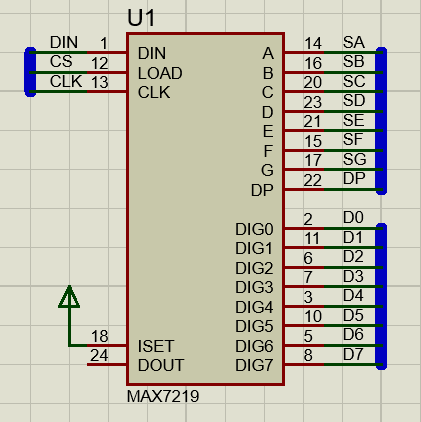
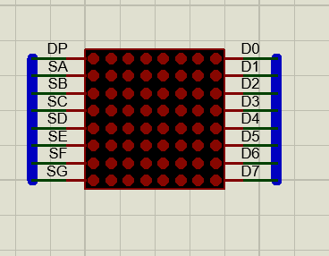
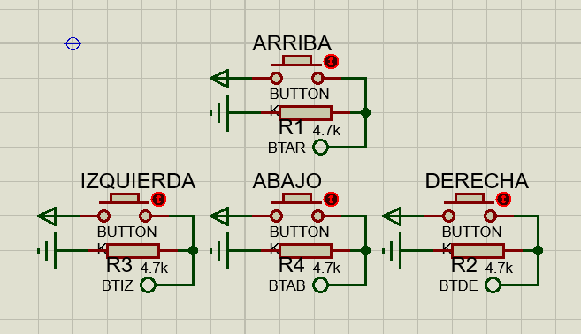

# SNAKE EN ARDUINO

 

En esta ocacion te hemos traido un ejemplo de la implementacion de un snake el cual esta hecho en arduino, del cual te hemos dejado el codigo fuente que hemos utilizado en nuestro video en el Canal de Youtube [DevTek](https://www.youtube.com/channel/UClawZxxlqfXzPetVvUnMb4g), para que lo puedas utilizar e implementar en tus proyectos.

--- 

# Elementos Utilizados

* <h2>Arduino Mega<h2> 

* <h2>MAX7219<h2>

* <h2>Matriz led 8x8 <h2>

* <h2>Joystick o Botones <h2>

---
# Librerias Utilizadas en Arduino

* LedControl

---
# Arduino  Mega
Pines de entrada
* pin 18: Boton Derecho
* pin 19: Boton Izquierda
* pin 20: Boton Arriba
* pin 21: Boton Abajo

Pines de Salida
* pin 12: DIN
* pin 13: CLK
* pin 14: CS

---
# MAX7219
Pines de entrada:  
* pin 1: DIN
* pin 12: CS
* pin 13: CLK
* pin 18: VCC  

Opcional:
* pin 24 (DOUT): conexion en cascada para otro MAX7219
---

# Configuracion en Proteus

 Se realizo una configuracion para un mejor uso del joystick en proteus utilizando botones del teclado.

>## Atajos de teclado:
  * Arriba ↑    ~   Numeral 2
  * Abajo ↓     ~   Numeral 3
  * Derecha →   ~   Numeral 4
  * Izquierda ← ~   Numeral 1

---
## Video Tutorial 

Aca te hemos dejado un video en nuestro canal oficial de Youtube, en donde te mostramos todo el armado de este juego simulado, utilizando proteus y arduino.

[Video]()

---

## Autor: DevTek

[Canal de Youtube](https://www.youtube.com/channel/UClawZxxlqfXzPetVvUnMb4g) :coffee:

